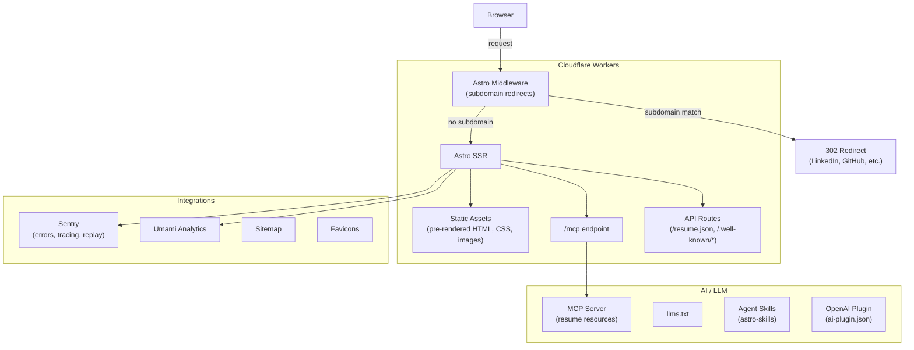

# frank-blechschmidt.com

Personal portfolio website built with [Astro](https://astro.build/) and deployed to [Cloudflare Workers](https://workers.cloudflare.com/). Themed with [dev-portfolio-ai](https://github.com/FraBle/dev-portfolio-ai).

## Architecture



## Tech Stack

- **Framework:** Astro 6 (SSR mode)
- **Hosting:** Cloudflare Workers
- **Runtime:** Bun (via [mise](https://mise.jdx.dev/))
- **Theme:** [dev-portfolio-ai](https://github.com/FraBle/dev-portfolio-ai) (Tailwind CSS 4, Alpine.js, dark/light mode)
- **Icons:** [simple-icons-astro](https://github.com/dzeiocom/simple-icons-astro) (3,000+ brand SVGs)
- **Observability:** Sentry (errors, tracing, session replay, logs)
- **Analytics:** Umami (optional, via env var)
- **CI/CD:** GitHub Actions + wrangler-action
- **Testing:** Vitest (100% coverage)
- **Linting:** oxlint, markdownlint-cli2, Semgrep (SAST), reviewdog + actionlint
- **Git hooks:** husky + lint-staged + commitlint (Conventional Commits)

## Features

- Single-page portfolio with composable sections (Hero, Experience, Education, Projects, Patents, Skills)
- Dark/light mode with 5 colour themes + Cmd/Ctrl+K command palette
- Print-optimized layout for PDF export
- Resume download (PDF) prominently linked
- Subdomain redirects via middleware (e.g., `linkedin.frank-blechschmidt.com` -> LinkedIn)
- Machine-readable section with links to AI endpoints
- [MCP server](https://modelcontextprotocol.io/) exposing resume data to AI tools (`/mcp`)
- Machine-readable resume ([JSON Resume](https://jsonresume.org/) at `/resume.json`)
- AI-native discovery (`/llms.txt`, `/.well-known/ai-plugin.json`, agent skills)
- WebFinger identity federation (`/.well-known/webfinger`)
- Security policy (`/.well-known/security.txt`)
- Favicon generation from avatar image
- Preview deployments on PRs with automatic cleanup

## Development

```bash
bun install
bun run dev       # Astro dev server (localhost:4321)
```

## Build & Preview

```bash
bun run build     # Production build to dist/
bun run preview   # Preview via Wrangler locally
```

## Testing

```bash
bun run test              # Run tests
bun run test:coverage     # Run with coverage (100% thresholds)
bun run lint              # oxlint
bun run lint:md           # markdownlint
```

## Deployment

Deploys automatically on push to `main` via GitHub Actions. PRs get preview deployments.

### Required GitHub Secrets

| Secret                    | Description                              |
| ------------------------- | ---------------------------------------- |
| `CLOUDFLARE_API_TOKEN`    | Cloudflare API token (Workers write)     |
| `CLOUDFLARE_ACCOUNT_ID`   | Cloudflare account ID                    |
| `PUBLIC_SENTRY_DSN`       | Sentry DSN for error tracking            |
| `SENTRY_AUTH_TOKEN`       | Sentry auth token for source map uploads |
| `PUBLIC_UMAMI_WEBSITE_ID` | Umami website ID (optional)              |

### Required Cloudflare Worker Secrets

```bash
wrangler secret put SENTRY_DSN   # Server-side Sentry DSN
```

## Project Structure

```text
├── public/                  # Static assets (avatar, resume PDF, robots.txt)
├── skills/                  # Agent skill definitions (astro-skills)
├── src/
│   ├── __tests__/           # Vitest tests (100% coverage)
│   ├── pages/
│   │   ├── index.astro      # Portfolio page (pre-rendered)
│   │   ├── 404.astro        # Error page (pre-rendered)
│   │   ├── mcp.ts           # MCP server endpoint
│   │   ├── resume.json.ts   # JSON Resume API
│   │   └── .well-known/     # ai-plugin.json, mcp.json, webfinger, security.txt
│   ├── middleware.ts         # Subdomain redirect handler
│   ├── subdomain.ts         # Subdomain extraction logic
│   ├── mcp.ts               # MCP server definition and resources
│   ├── resume.ts            # Resume data (single source of truth)
│   └── site.config.ts       # Site config, redirects
├── sentry.client.config.ts  # Sentry client (tracing, replay, logs)
├── sentry.server.config.ts  # Sentry server (tracing, logs)
├── astro.config.mjs         # Astro + Cloudflare adapter + integrations
├── wrangler.jsonc            # Cloudflare Workers config
└── vitest.config.ts          # Test config (100% coverage thresholds)
```

## License

[MIT](LICENSE)
